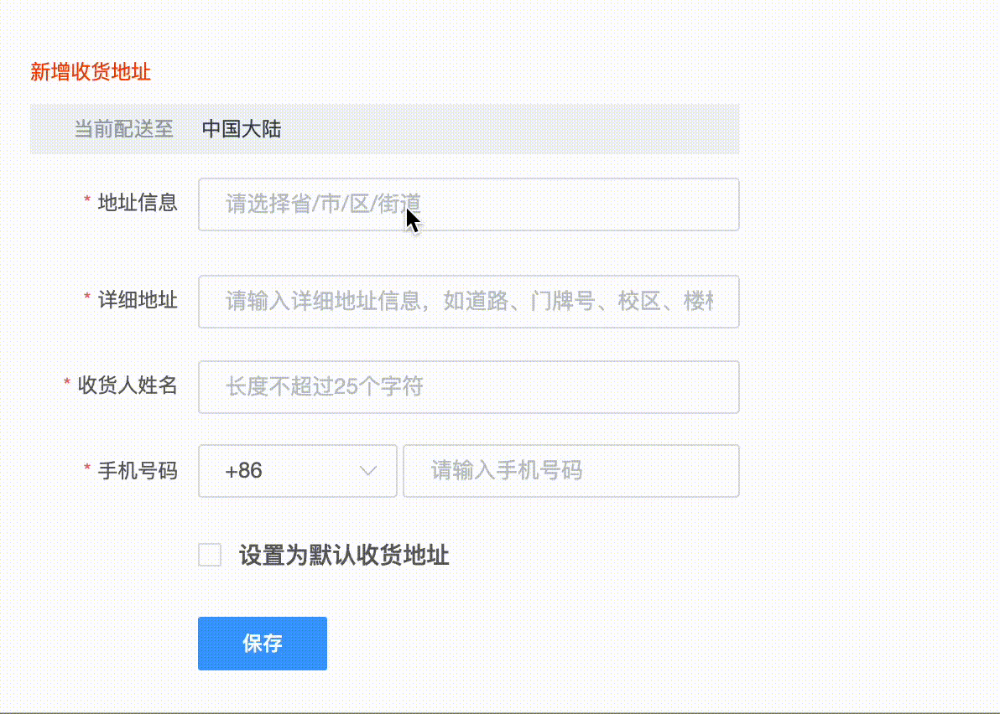

# 四级地址选择器

## 安装

`npm i vue-next-address-picker`

## 使用

```javascript
    import VueNextAddressPicker from "vue-address-picker"
    <template>
        <vue-next-address-picker  
                :visible="showPickerRef"
                @choice="choiceAddress"
                @close="showPickerRef=false"
                :pickerLevel="4"
                >
        </vue-next-address-picker>
    </template>
    <script setup>
        import {ref} from "vue"
        const showPickerRef = ref(false);
        const choiceAddress = data=>{
            const {province,city,area,street} = data.province;
            console.log(data)
        }
    </script>
```

## 效果



## 属性

| 属性名 | 属性值 | 说明 |
| :---: | :---: | :---: |
| `borderColor` | string | 边框颜色,默认`#f1f2f6` |
| `highlightBg` | string | 高亮背景色，默认`#f40` |
| `width` | string | 宽度，默认`100%` |
| `height`| string | 高度,默认`300px`|
| `visible` | boolean | 是否显示组件 |
| `pickerLevel` | number | 级联级别 1~4 |

## 事件

| 事件名 | 说明 | 参数 |
| :---: | :--:| :--: |
| `close` | 组件隐藏时触发 | - |
| `choice` | 级联选择完成触发 | 地址信息:`{province,area,city,street}` |
